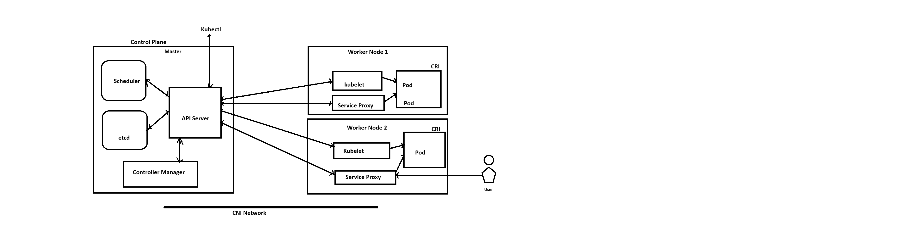
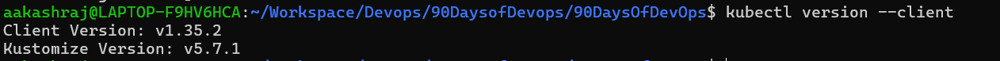
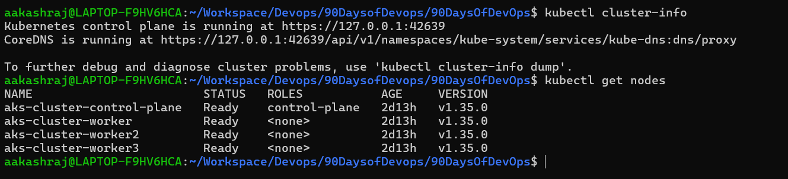
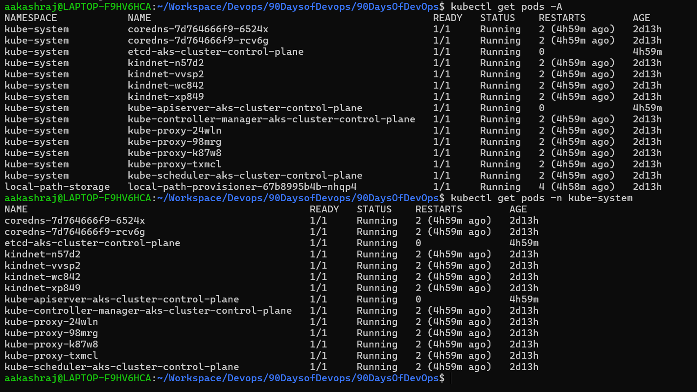
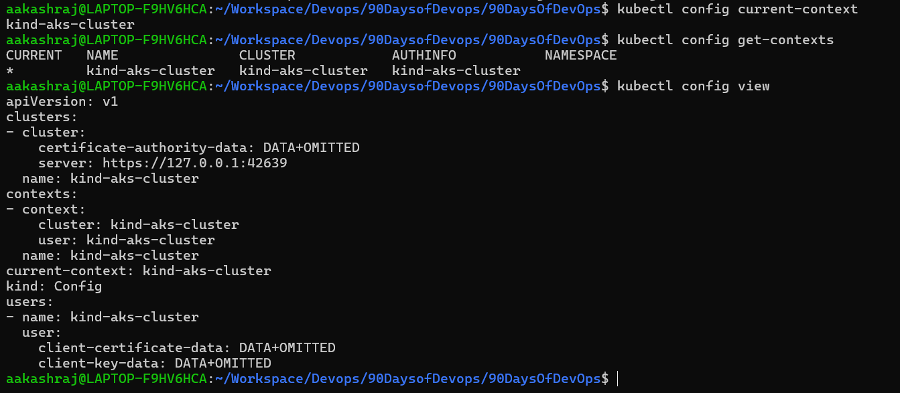

# Day 50 – Kubernetes Architecture and Cluster Setup

## Task
You have been building and shipping containers with Docker. But what happens when you need to run hundreds of containers across multiple servers? You need an orchestrator. Today you start your Kubernetes journey — understand the architecture, set up a local cluster, and run your first `kubectl` commands.

## Expected Output
- A running local Kubernetes cluster (kind or minikube)
- A markdown file: `day-50-k8s-setup.md`
- Screenshot of `kubectl get nodes` showing your cluster is ready

---

## Challenge Tasks

### Task 1: Recall the Kubernetes Story
Before touching a terminal, write down from memory:

1. Why was Kubernetes created? What problem does it solve that Docker alone cannot?
```
Docker is great for: Building containers, Running containers on a single machine
But in real-world production, we need: 
Run containers across multiple servers
Auto-healing (restart failed containers)
Auto-scaling (handle traffic spikes)
Load balancing

Kubernetes solves:
Kubernetes is a container orchestration platform that provides:
Cluster management: run containers across many nodes
Auto-healing: restart failed containers
Auto-scaling: scale based on load
Service discovery & load balancing
```
2. Who created Kubernetes and what was it inspired by?
```
Kubernetes was created by Google

Inspiration: Kubernetes was inspired by Google’s internal system: Borg
Borg managed containers at massive scale inside Google

Kubernetes is basically a simplified, open-source version of Borg concepts
```
3. What does the name "Kubernetes" mean?
```
Derived from Greek word “κυβερνήτης (kybernētēs)” meaning “Helmsman” or “Ship Pilot”

Containers = ships
Kubernetes = the system that steers and manages them
```
---

### Task 2: Draw the Kubernetes Architecture
From memory, draw or describe the Kubernetes architecture. Your diagram should include:

**Control Plane (Master Node):**
- API Server — the front door to the cluster, every command goes through it
- etcd — the database that stores all cluster state
- Scheduler — decides which node a new pod should run on
- Controller Manager — watches the cluster and makes sure the desired state matches reality

**Worker Node:**
- kubelet — the agent on each node that talks to the API server and manages pods
- kube-proxy — handles networking rules so pods can communicate
- Container Runtime — the engine that actually runs containers (containerd, CRI-O)



After drawing, verify your understanding:
- What happens when you run `kubectl apply -f pod.yaml`? Trace the request through each component.
```
Step-by-step flow when i run `kubectl apply -f pod.yaml`:

Step 1: kubectl -> API Server
- Sends request (create Pod)

Step 2: API Server
- Validates request
- Stores desired state in etcd

Step 3: Controller Manager
- Detects new Pod needs to be created

Step 4: Scheduler
- Picks best worker node

Step 5: API Server updates etcd
- Pod assigned to a node

Step 6: kubelet (on selected node)
- Watches API Server
- Sees new pod assigned

Step 7: kubelet -> Container Runtime

- Pulls image
- Starts container

Step 8: kube-proxy(Service Proxy)
- Sets up networking rules
```
- What happens if the API server goes down?
```
If API Server goes down:
- You cannot run kubectl commands
- No new pods can be scheduled
- Existing pods keep running (no immediate crash)
- Controllers stop working → no healing
- Cluster becomes unmanageable but not dead
```
- What happens if a worker node goes down?
```
If Worker Node goes down
- kubelet stops sending heartbeats
- Controller Manager detects node failure
- Node marked as NotReady
- Pods on that node -> considered lost
- Scheduler creates new pods on other nodes

This is self-healing (core Kubernetes feature)
```
---

### Task 3: Install kubectl
`kubectl` is the CLI tool you will use to talk to your Kubernetes cluster.

Install it:
```bash
# macOS
brew install kubectl

# Linux (amd64)
curl -LO "https://dl.k8s.io/release/$(curl -L -s https://dl.k8s.io/release/stable.txt)/bin/linux/amd64/kubectl"
chmod +x kubectl
sudo mv kubectl /usr/local/bin/

# Windows (with chocolatey)
choco install kubernetes-cli
```

Verify:
```bash
kubectl version --client
```


---

### Task 4: Set Up Your Local Cluster
Choose **one** of the following. Both give you a fully functional Kubernetes cluster on your machine.

**Option A: kind (Kubernetes in Docker)** (Picked)
```bash
# Install kind
# macOS
brew install kind

# Linux
curl -Lo ./kind https://kind.sigs.k8s.io/dl/latest/kind-linux-amd64
chmod +x ./kind
sudo mv ./kind /usr/local/bin/kind

# Create a cluster
kind create cluster --name devops-cluster

# Verify
kubectl cluster-info
kubectl get nodes
```


**Option B: minikube**
```bash
# Install minikube
# macOS
brew install minikube

# Linux
curl -LO https://storage.googleapis.com/minikube/releases/latest/minikube-linux-amd64
sudo install minikube-linux-amd64 /usr/local/bin/minikube

# Start a cluster
minikube start

# Verify
kubectl cluster-info
kubectl get nodes
```

Write down: Which one did you choose and why?

I prefer KIND because it runs Kubernetes inside Docker, making it lightweight, fast, and ideal for CI/CD and  multi-node simulations. Minikube is better for beginners due to its simplicity and built-in addons, GUI Dashboard   but KIND is closer to real-world DevOps workflows.

---

### Task 5: Explore Your Cluster
Now that your cluster is running, explore it:

```bash
# See cluster info
kubectl cluster-info

# List all nodes
kubectl get nodes

# Get detailed info about your node
kubectl describe node <node-name>

# List all namespaces
kubectl get namespaces

# See ALL pods running in the cluster (across all namespaces)
kubectl get pods -A
```

Look at the pods running in the `kube-system` namespace:
```bash
kubectl get pods -n kube-system
```

You should see pods like `etcd`, `kube-apiserver`, `kube-scheduler`, `kube-controller-manager`, `coredns`, and `kube-proxy`. These are the architecture components you drew in Task 2 — running as pods inside the cluster.

**Verify:** Can you match each running pod in `kube-system` to a component in your architecture diagram?

---

### Task 6: Practice Cluster Lifecycle
Build muscle memory with cluster operations:

```bash
# Delete your cluster
kind delete cluster --name devops-cluster
# (or: minikube delete)

# Recreate it
kind create cluster --name devops-cluster
# (or: minikube start)

# Verify it is back
kubectl get nodes
```

Try these useful commands:
```bash
# Check which cluster kubectl is connected to
kubectl config current-context

# List all available contexts (clusters)
kubectl config get-contexts

# See the full kubeconfig
kubectl config view
```

Write down: What is a kubeconfig? Where is it stored on your machine?

- kubeconfig is a file that stores cluster connection details, authentication credentials, and contexts, allowing
kubectl to interact with Kubernetes clusters

- It will get stored in /home/ubuntu/.kube/config
---